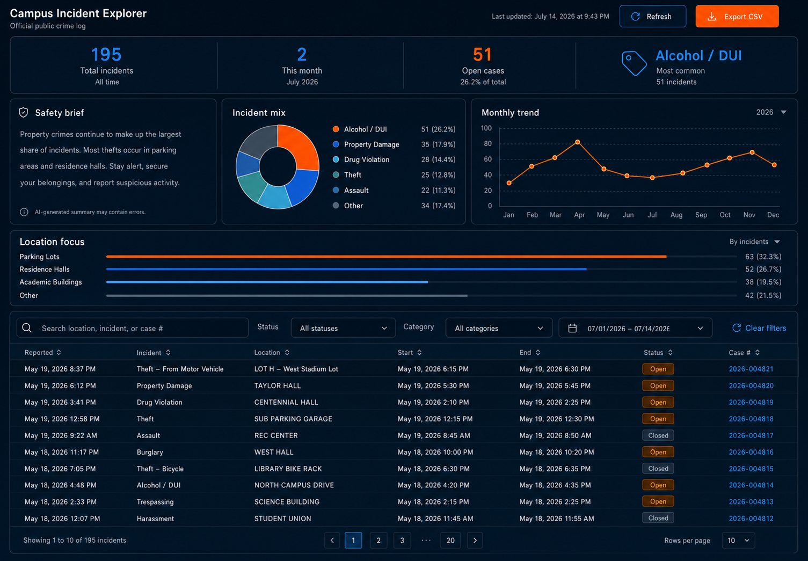

# Campus Incident Explorer

An independent dashboard for exploring Boise State University's public campus crime log. The project turns a difficult-to-scan source table into searchable records, trend charts, category summaries, case-status filters, a campus heatmap, and CSV exports.



## Highlights

- Search, sort, filter, and paginate public incident records
- Compare incident categories and monthly trends
- Explore approximate incident locations on an interactive campus heatmap
- Export the current filtered view as CSV
- Generate a concise safety brief directly from the loaded dataset
- Refresh the source data automatically with GitHub Actions
- Adapt across desktop and mobile layouts with accessible reduced-motion behavior

## How it works

```text
Boise State public crime log
          |
          v
  Cheerio scraper ----> public/crime-data.json
                              |
                              v
                    Next.js dashboard
                    | charts | map | table |
```

The scheduled workflow runs the scraper every 12 hours. The scraper parses the university's public table and commits only when the dataset changes. The browser reads the resulting static JSON, derives categories and summary metrics, and renders the dashboard without a database or private API.

## Technology

- Next.js 15, React 19, and TypeScript
- Chart.js and React Chart.js 2
- MapLibre GL
- Axios and Cheerio
- GitHub Actions

## Run locally

Requirements: Node.js 20 or newer and npm.

```bash
cd smurflasso
npm ci
npm run dev
```

Open [http://localhost:3000](http://localhost:3000). To refresh the local dataset from the public source, run:

```bash
npm run scrape
```

## Quality checks

```bash
cd smurflasso
npm run lint
npm run build
```

## Project structure

```text
.github/workflows/scrape.yml   Scheduled data refresh
smurflasso/app/                Dashboard UI and data transformations
smurflasso/public/             Static incident dataset and public assets
smurflasso/scrape.js           Public crime-log scraper
smurflasso/design/             Design explorations and responsive concepts
```

## Data and limitations

This is an unofficial project and is not affiliated with Boise State University. Records come from the university's [official public crime log](https://www.boisestate.edu/publicsafety-security/campus-crime/campus-crime-log/). The dashboard may lag behind the source, category labels are derived from report descriptions, and map coordinates are approximate. Do not use this project for emergencies or as a substitute for official safety guidance.

## License

Source code is available under the [MIT License](LICENSE). The incident data belongs to its original publisher and is provided here for demonstration and informational use.

Built by [Cole Kreiling](https://colekreiling.com).
